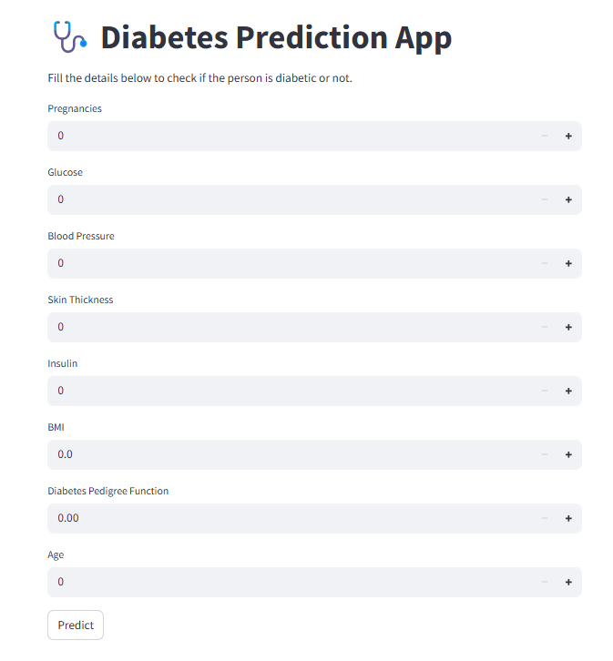

# Diabetes Prediction model using FastAPI
Diabetes Prediction model - FastAPI

#### RUN: For setup
conda create -n diabetes-prediction python=3.10 -y
conda activate diabetes-prediction
python template.py

#### First, start your FastAPI backend
uvicorn m1_app:app --reload

#### Then, in another terminal, run the Streamlit app:
streamlit run app.py

#### You’ll see a Streamlit UI in your browser at http://localhost:8501 where users can enter the required health metrics and click "Predict" to get the result (Diabetic or Not).

